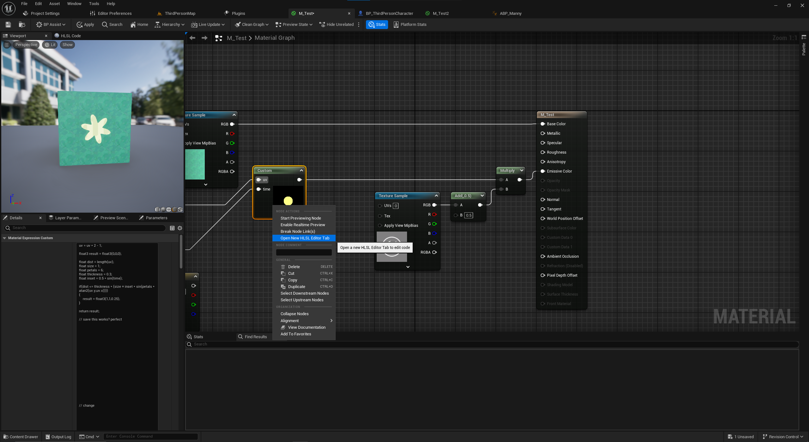
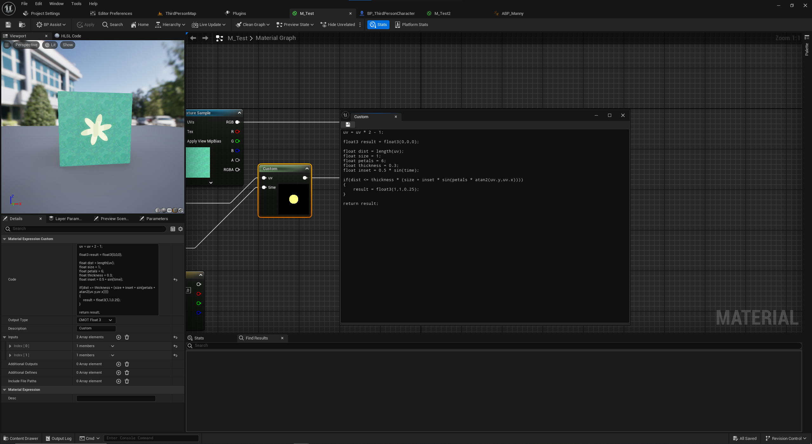
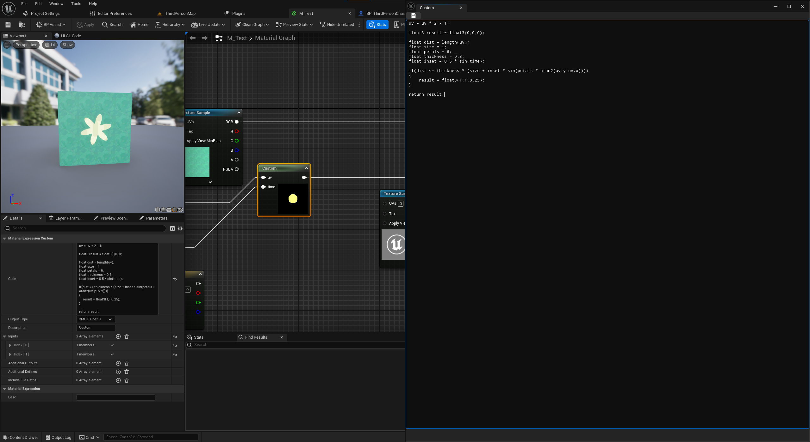

# CustomHLSLNodeEditor

Plugin that allows the user to create a separate window for editing HLSL code for the Custom Node in Material Graphs/Shaders.
* Write/Edit HLSL code from within the editor for Custom Nodes without having to open a separate program

## How To Use
* Accessed by right-clicking on a Custom node and using the new "Open New HLSL Editor Tab" option.
  * Option will only show up when right-clicking on a Custom node under the "Node Actions" section

* Simple window editor to edit HLSL Code and save.
  * Tab name/label corresponds to the Custom node's "Description" property
    * The name of the custom node in the Material Graph is also tied to this property (Default UE5 behavior)

* Window can be freely moved around, resized, etc. that is expected behavior of Unreal Document Tabs.
  * Implemented with Unreal's Slate UI framework, specifically as a "Document" Tab
  * Opening a new HLSL editor tab for the first time will open as a separate window from the main editor.
    * Opening more tabs will add tabs to the window if that window is still open (rather than spawning a new window)

